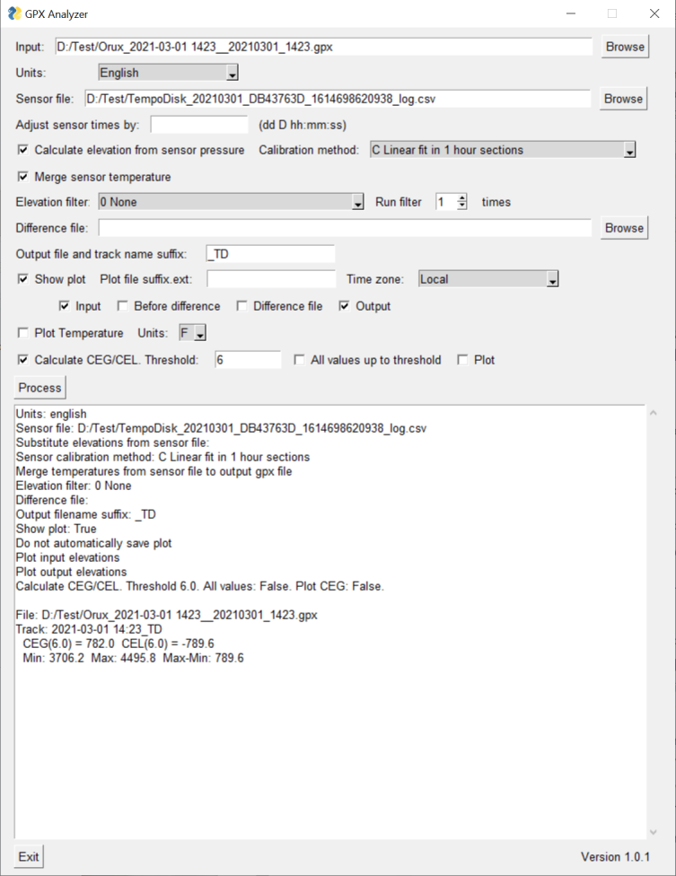
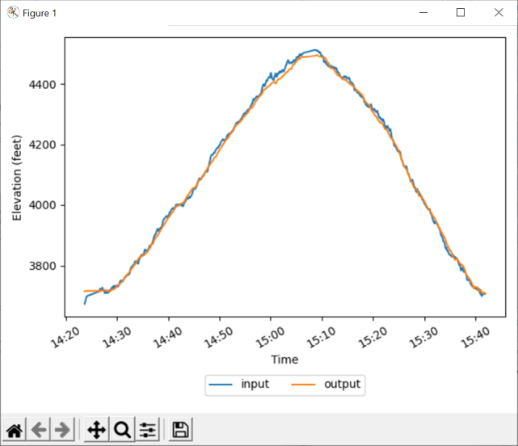

[GPXAnalyzer](https://github.com/dmcclimans/GPXAnalyzer)
==========

Version 1.0.1  (2021-04-30)

GPXAnalyzer is a program to analyze and modify GPX files recorded by a smartphone or
dedicated GPS device. It can calculate the Cumulative Elevation Gain (CEG) or Loss (CEL),
apply smoothing filters to the elevation data, and replace the elevation data with
elevations calculated from a Tempo Disc pressure sensor.

GPXAnalyzer is a Python program that can, in theory, run on Windows, Mac OSX, or Linux.
I run it on Windows, and I provide an installer for a Windows 10 64-bit version.
Users of other operating systems will have to run Python and import and run the
GPXAnalyzer code.

## Contents
*   [Features](#features)
*   [Requirements](#requirements)
*   [Installation](#installation)
*   [Problems with GPS elevation data](#problems-with-gps-elevation-data)
*   [Tempo Disc Sensor](#tempo-disc-sensor)
*   [Usage](#usage)
*   [Sample Chart](#sample-chart)
*   [Command Line Usage](#command-line-usage)
*   [License](#license)

## Features
*   Import temperature and pressure data from a Tempo Disc sensor.
*   Use the Tempo Disc pressure data as a more accurate elevation. The modified elevation
    can be written to a new GPX file.
*   Add the Tempo Disc temperature data to the GPX file.
*   Filter (smooth) the elevation values using a variety of filter functions.
*   Calculate the Cumulative Elevation Gain (CEG) and Cumulative Elevation Loss (CEL) of a
    GPS track.

## Requirements
*   Requires Windows 10.
*   Requires the 64-bit version of Windows.
*   Should run under Mac OSX and Linux, but has not been tested in those environments.

## Installation
*   Go to the GPXAnalyzer
    [latest release](https://github.com/dmcclimans/GPXAnalyzer/releases/latest)
    page and download `GPXAnalyzer_x.y.z.zip` (where x.y.z is the version number).

*   Run the installer program and follow the prompts.

## Problems with GPS elevation data

Elevation data collected by GPS units is much less accurate than position data.
The general rule of the thumb is that vertical error is three times the horizontal error.
If a decent signal reception is available, a modern GPS receiver should be able to give
elevation data accurate to a range of 10 to 20 meters (35 to 70 feet) post correction.
However, GPS reception can be horrible.
It is not uncommon for GPS elevations to be off by +/-102 meters (400') or more.

## Tempo Disc Sensor

The Tempo Disc 4-in-1 sensor combines a barometer, temperature sensor, and relative
humidity sensor. It also calculates the dew-point from the temperature and relative
humidity, which is how it gets its 4-in-1 name (even though it only contains 3 sensors).

We can use the Tempo Disc barometer (pressure sensor) to calculate altitude (elevation).
Pressure sensors make pretty good elevation sensors if you are concerned with *relative*
elevation changes. They do not yield accurate *absolute* elevation measurements, because
they are affected by the weather and by diurnal (24 hour) and semi-diurnal (12 hour)
changes in the base pressure.

To deal with this we need to calibrate the pressure sensor. One way to calibrate is to use
a known elevation, by reading the correct elevation for a location from a map or other
source, and then applying an offset to the barometer based elevation data. But this does
not account for pressure changes during your hike or other activity.

Another way to calibrate, and the one used by GPXAnalyzer, is to calibrate the pressure
sensor to the GPS elevations. If you do this over a relatively long time (say an hour),
you average out most of the errors of the GPS elevation data.

## Usage

1.  The **Input** text box contains the file (or list of files) to be processed.
    Use the **Browse** button to select the input files, or manually enter the path and
    file name.
    In the Open Files dialog you can select multiple files by holding down the ctrl or shift key
    while you click with the mouse. Use ctrl+A to select all files in a folder.

2.  The **Units** pull-down allows you to select Metric or English units. Elevations will be
    in meters for Metric units, and feet for English units.

3.  The **Sensor file** text box contains the file from a Tempo Disc unit which contains
    pressure and temperature data from the same time as the input file(s). If you leave this
    field blank, no sensor data will be used.

4.  Use the **Adjust sensor times by** field to adjust the times in the sensor file.
    Normally this field is left blank, but you can use it to adjust the sensor timestamps
    to match your GPX file. This may be necessary if the phone where you download data
    from your Tempo Disc sensor has a different time than your GPS unit.

    The field has the format "dd D hh:mm:ss", where dd is the number of days, hh is the
    number of hours, etc. The upper case "D" (or the word "days") must be included if you
    specify days. You can insert a minus sign before the days and/or before the hours.
    This field is actually quite flexible about the input format; it uses the python
    Pandas Timedelta object to perform the conversion. You can look that up if you
    wish, but it is generally easier to experiment with GPXAnalyzer. The actual
    adjustment time is shown in the output window when you click "Process".

5.  If you check **Calculate elevation from sensor pressure**, the barometer sensor will be
    used to calculate the elevation. For relative elevations, this is normally much more
    accurate than using the GPS elevation data.

    However, the pressure sensor is not accurate in an absolute sense. The data must be
    **calibrated** by aligning it (vertically) with the GPS data. You can select the
    calibration method to use. For most cases, the default "C Linear fit in 1 hour
    sections" is the best and most accurate choice.

6.  If you check **Merge sensor temperature**, the temperature data from the Tempo Disc will
    be merged into the GPX file. It will replace any existing temperature data if the GPX
    file already has some.

    Note that the Tempo Disc temperature sensor is affected by its location.
    If you are carrying it in a pocket, it will be affected by your body heat.
    If you are carrying it in a pack or bag, it may be affected by sunlight warming
    up the bag.
    If you suspend it where sunlight can reach it, it will be drastically affected by the
    sun.

7.  You can filter the elevation data using the **Elevation filter** pull-down.

    If you are using pressure data from the Tempo Disc, you probably don't need much if
    any filtering. I recommend using "0 None", or at most "A 3-point average".

    If you are using elevation data from a GPS without a barometer, I recommend
    using 5 or 7 point averaging (D or E). You can experiment with different options using
    this pull-down.

    You can also run the filter multiple times. I normally set this value to 1, but again,
    you can experiment with different settings. Running an unweighted (box) filter, such as A
    3-point, D 5-point, or E 7-point, multiple times approximates a Gaussian filter.

8.  The **Difference file** will be subtracted from the input file(s). This happens after
    merging the Sensor file and any filtering is applied.
    This is useful when you wish to process the file and then compare it with the
    original or some other file.

9.  Set the **Output file and track name suffix** when you want to output the processed
    output file. If you leave this field blank not output file will be written, but the
    output will still be plotted (if checked) and analyzed for CEG/CEL.

    If you specify a suffix, the suffix is added to each track name in file, and to the
    base filename when the file is written.

10. Check **Show plot** if you want to see the plots displayed interactively.

    Enter something in the **Plot file suffix.ext** field to have the system write a
    plot file. This field will be added as a suffix to the input file name. For example,
    if the input file name is MyHike.gpx, and you enter _TD.png as the plot suffix, the
    output file will be MyHike_TD.png.

    GPXAnalyzer can output .PNG or .SVG file, but it cannot output .JPG files.

    Set the **Time zone** to control the times that are displayed in the chart.
    A setting of "Local" will use the local time of the computer you are running on.
    "UTC" will use Universal Coordinate Time.
    Otherwise, select the desired time zone from the pull-down.

11. Check the desired **Plot options** to plot the results of processing the elevation
    data.

12. Check **Plot Temperature** to see a plot of temperatures. This will only take effect
    if "Merge sensor temperature" is checked.

    You can select between Fahrenheit and Celsius temperature unit.

13. Check the **Calculate CEG/CEL** to calculate Cumulative Elevation Gain (CEG) and
    Cumulative Elevation Loss (CEL) over the output data.

    If you specify a non-zero **Threshold**, changes of less than that value will be
    ignored by algorithm. The Threshold is specified in meters or feet, depending on how
    you have set the **Units**.

    I normally specify a threshold of 6 feet or 2 meters for elevation data based on a
    barometer (pressure). Elevation changes of less than this distance are most likely
    noise. For GPX elevation data, I normally use a larger threshold such as 20 or 30 feet
    (6 to 9 meters).

    If you check **All values up to threshold**, the system will calculate CEG and CEL for
    all integer values up to the threshold you specify. For example, if you specify "4",
    the system will calculate CEG and CEL for thresholds 1, 2, 3, and 4.

    If you check **Plot**, the system will display a plot of the CEG values you calculated.

15. Click the **Process** button to process the data according to the settings above.

## Sample Chart

Here is a sample chart produced by GPXAnalyzer. The blue "input" line shows the elevations
as recorded by the GPS (OruxMaps running on an Android phone).
The orange "output" line shows the elevations as computed by GPXAnalyzer using barometric
pressure data from a Tempo Disc sensor.

## Command Line Usage

GPXAnalyzer can also be run from the command line. Run

        GPXAnalyzer --help

to get information on command line parameters. The parameters correspond to the settings
in the graphical user interface described above.

If you run GPXAnalyzer without any command line parameters it will display the graphical
user interface as described above.

## License
GPXAnalyzer is licensed under the MIT license. You may use the GPXAnalyzer application in
any way you like. You may copy, distribute and modify the GPXAnalyzer software provided you
include the copyright notice and license in all copies of the software.

GPXAnalyzer uses a variety of components that are licensed under the Apache License,
BSD license, MIT license, and similar free-to-use licenses. If you modify the GPXAnalyzer
source code you are responsible for meeting the license requirements of any components
used.

See the [License.txt](License.txt) file for additional information.

